# User guide

Graticule maps working relationships in a team or organisation of about 5 to 250 people. Each person rates their colleagues on one or more relationships, such as how strong their working connection is or how often they collaborate informally. Graticule turns those ratings into a network map, metrics, rule-based observations and a presentation.

It describes the structure of a network. It does not evaluate anyone, and its results should not be used to assess individual performance. Everything happens in your browser: there is no server, and the page is blocked from sending data anywhere.

This guide is also in Graticule, under Help → User guide. The definition of every measure, rule and threshold is in the [method notes](method-notes.md). A one-page guide you can send to participants is in [Help for respondents](respondent-help.md).

Every screenshot here uses the fictional demo, with names hidden.

## Getting started

Open Graticule in a current version of Chrome, Edge, Firefox or Safari on a computer. A tablet works too; on a phone, projects can be viewed and explored but not changed.

The first time you open Graticule it shows a notice about data and consent. Read it before you load any real data: it summarises the points in [Ethics and consent](#ethics-and-consent). You can read it again at any time from Help → Data and consent notice.

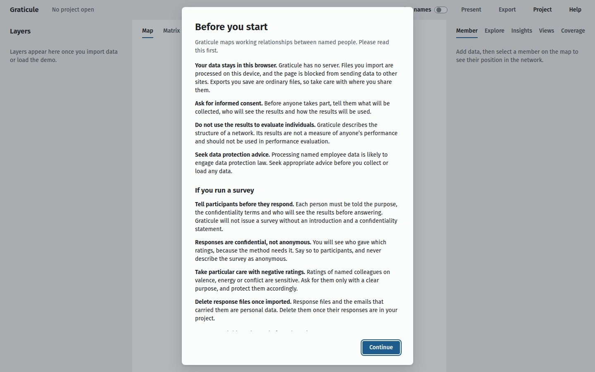

The empty workspace offers three ways in: run a survey, import survey data you already hold, or load the demo. The demo is a fictional organisation of 40 people in five teams, built to contain a broker between teams, a team that keeps to itself, a pocket of reciprocated negative ratings and a clear mismatch between formal and informal ties. It is the quickest way to learn the tool.

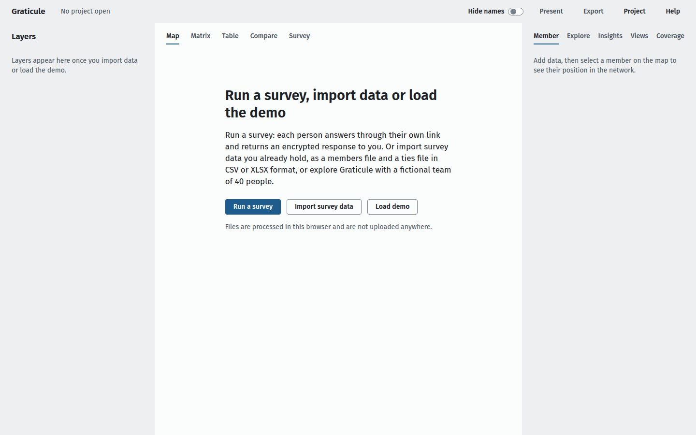

The workspace has three columns: settings on the left (weights, map settings and layers), views in the centre (Map, Matrix, Table, Compare and Survey), and details on the right (Member, Explore, Insights, Views and Coverage). The top bar holds the coverage figure, the Hide names switch, Present, Export, the Project menu and Help.

### Projects and local storage

A project is saved as a single file ending in `.ona.json`, which holds the members, layers, ratings, saved views, surveys and settings. Use Project → Save project to download it and Project → Open project… to open it again. Keep project files as you would any personal data; never commit them to a public repository.

Graticule does not keep anything in the browser unless you ask it to. Project → Keep a copy in this browser stores the open project on this device, and the top bar says "Kept in this browser" while it is on. Project → Clear local data… deletes everything Graticule has stored in this browser, including that copy and your preferences.

## Preparing data from the templates

If your ratings were collected outside Graticule, prepare two files. Templates in CSV and XLSX are linked from the Import survey data dialog, under "Download a template".

**Members file.** One row per person.

| Column | Required | Contents |
|---|---|---|
| `id` | Yes | A unique identifier, for example `M01`. Avoid names or email addresses, which would appear wherever ids do |
| `display_name` | Yes | The name shown in Graticule |
| `team` | No | Team or function; used for colours, grouping, silo checks and the codes shown when names are hidden |
| `level` | No | Grade or level; used in the codes shown when names are hidden |
| `location` | No | Location |
| `tenure_band` | No | For example "1 to 3 years" |
| `manager_id` | No | The `id` of the person's formal manager; enables the formal hierarchy layout |
| `email` | No | Used only to send survey links; never shown in analysis views or exports |
| any other | No | Becomes a member attribute you can colour, filter and group by |

**Ties file.** One row per rating, in long format.

| Column | Required | Contents |
|---|---|---|
| `rater_id` | Yes | The id of the person giving the rating |
| `ratee_id` | Yes | The id of the person being rated |
| `variable` | Yes | The layer's key, for example `connection_strength` (the keys are listed in the [method notes](method-notes.md#10-relationship-layers)) |
| `value` | Yes | The rating: a plain number within the layer's scale. Leave it empty if no rating was given, and write `n/a` if the question does not apply to that pair |
| `wave` | No | The survey wave; empty means 1 |

Three rules matter most:

- **An empty value is not a zero.** A rating of 0 means "no connection" or "never" (on valence, "neutral"). An empty cell means the person did not answer, and is counted as missing, never as 0.
- **`n/a` means the question does not apply**, for example the quality of a relationship someone does not have. It is neither 0 nor missing, and it is left out of coverage.
- **Ratings are directed.** A's rating of B and B's rating of A are separate rows, and may differ.

Save spreadsheets as CSV (UTF-8) or XLSX. Graticule reads the first sheet of an XLSX file and the values stored in cells, not their display format.

### Layers

Each relationship you rate is a layer. Four core layers are turned on in a new project: connection strength, valence, informal collaboration and formal collaboration. Twelve optional layers can be turned on in the Layers section of the left column, including advice seeking, two kinds of trust, energy, workflow dependency, interpersonal safety and two kinds of conflict. Edit a layer to change its label or question wording. The full list, with scales and suggested wording, is in the [method notes](method-notes.md#10-relationship-layers).

Ask only about the layers you need. Each extra layer adds a rating per colleague for every respondent.

## Running a roster survey

Graticule can run the survey itself. Each person receives a personal link, answers on their phone or computer, and sends you back an encrypted response by email or as a file. You import all the responses at once. Nothing passes through a server.

The design is a whole-network (roster) survey: every person is asked about their colleagues on the roster. It works only if most people respond, so plan for a high response rate (80 % or more) before you start.

### Before you start

1. Import a members file (Project → Import survey data…) listing everyone who will take part. Include an `email` column if you want a mail-merge list of links.
2. Turn on the layers you want to ask about, and check their wording in the Layers section.
3. Agree the purpose, who will see the results and how long the data will be kept, and take data protection advice (see [Ethics and consent](#ethics-and-consent)).

### Setting up

Open the Survey tab and choose Set up a survey.

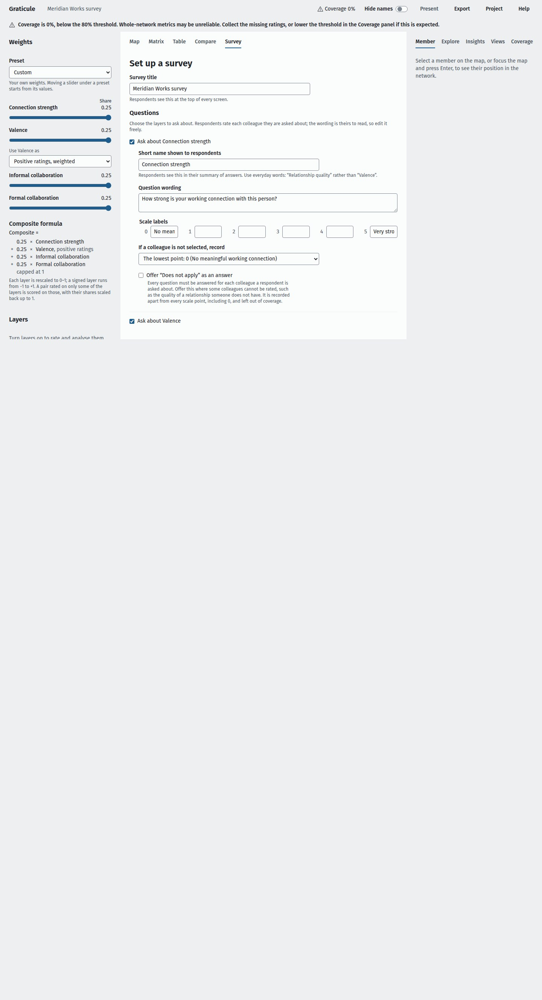

**Questions.** Tick the layers to ask about. For each, set:

- **Short name shown to respondents**, in everyday words: "Relationship quality" reads better than "Valence".
- **Question wording** and **scale labels**, which respondents see while they answer. The default wording for the core layers is:

| Layer | Question | Scale |
|---|---|---|
| Connection strength | How strong is your working connection with this person? | 0 No meaningful working connection … 5 Very strong |
| Valence | Overall, how positive or negative is your working relationship with this person? | −3 Very negative, 0 Neutral, +3 Very positive |
| Informal collaboration | How often do you collaborate with this person outside formal roles, processes or reporting lines? | 0 Never, 1 Less than monthly, 2 Monthly, 3 Weekly, 4 Several times a week, 5 Daily |
| Formal collaboration | How often does your role, a process or a reporting line require you to collaborate with this person? | As above |

- **Offer "Does not apply" as an answer.** Every question must be answered for every colleague a respondent is asked about. Offer "Does not apply" where some colleagues cannot be rated, such as the quality of a relationship someone does not have. It is on by default for signed layers (valence, energy), where 0 means neutral.

**How respondents choose colleagues.**

- **Select colleagues, then rate them** (the default). Respondents first select the people they have a working relationship with ("Select everyone you have a working relationship with." by default; you can edit it), then answer only about them. For each layer, choose what a colleague who is not selected records: the lowest point (for example 0, "Never") or "Does not apply". Unsigned layers default to the lowest point; valence and energy default to "Does not apply", because 0 there would record a neutral relationship nobody reported. Respondents are told what not selecting someone records.
- **Colleagues everyone is asked about.** With selection, tick people every respondent should rate whether or not they select them, for example a leadership team.
- **Rate every colleague.** Respondents answer every question about everyone. This is simplest to interpret but long for large teams.

**What respondents read.** The introduction (the purpose and how the results will be used), the confidentiality statement (who will see the answers and the results) and the return instructions (where to send the response, for example an email address) are all required. Responses are confidential, not anonymous: you will see who gave which ratings. Say so, and never describe the survey as anonymous.

**Estimated time.** Graticule estimates the time each respondent needs (a minute to start, 5 seconds a rating, 2 seconds to consider each colleague when selecting) and warns when it passes the limit, 15 minutes by default. Long surveys are abandoned or answered carelessly: ask about fewer layers, or use selection. The rules are in the [method notes](method-notes.md#completion-time-estimate).

**Links.** A link carries the whole survey and works on its own up to 2,000 characters. Longer surveys use a shared survey file with a short personal link. Choose "Always use a survey file with short links" if your organisation's email rewrites links for security scanning.

### Protecting the responses

Responses are encrypted to a key that only this survey holds. Choose a passphrase of at least 12 characters (a few unrelated words work well), then Create the key. Download the key backup, keep it somewhere safe apart from the project file, and open it again with Choose the backup file to prove the file and passphrase work. Only then can you create the survey.

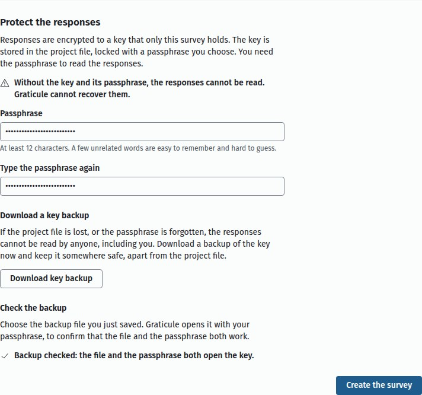

If the key and its backup are lost, or the passphrase is forgotten, nobody can read the responses, including you.

### Sending links

The survey dashboard shows links issued, responses imported, the response rate against the coverage threshold, duplicates and rejected files.

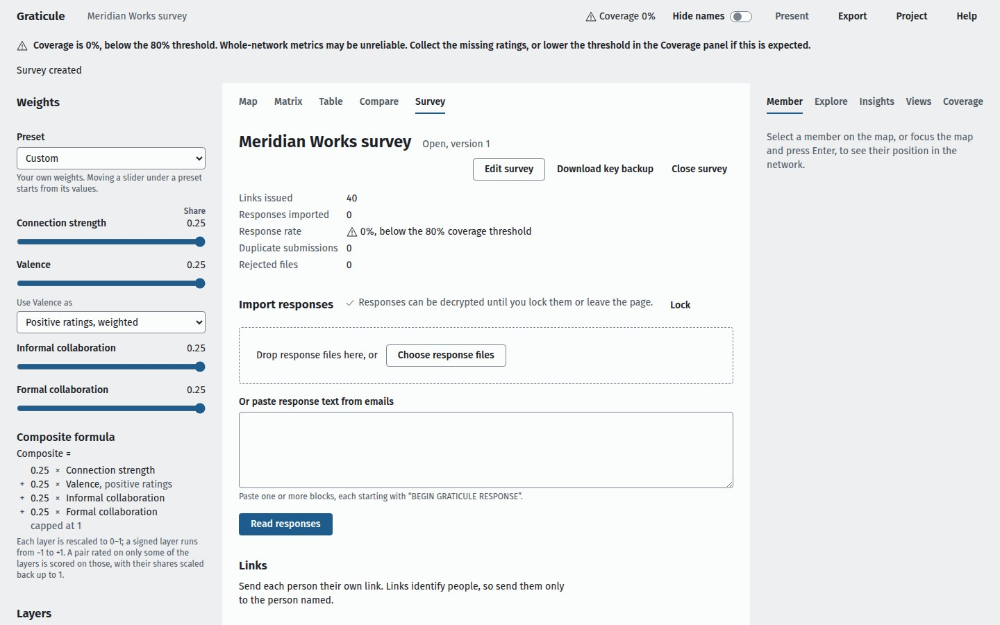

Under Links, copy each person's link, or use Export links for mail merge to save a CSV of names, email addresses and links. Send each link only to the person it names: anyone holding a link can answer as that person. If the survey uses a survey file, send everyone the same file with their own short link. The mail-merge and non-responder files contain personal data by design; delete them when you no longer need them.

### What respondents see

Respondents see a welcome screen with your introduction, the estimated time, the deadline and your confidentiality statement, then a consent step, then a check that the link is theirs. They select colleagues (if you chose selection), answer every question, check their answers, and encrypt them. Their progress is saved on their own device until they send the response.

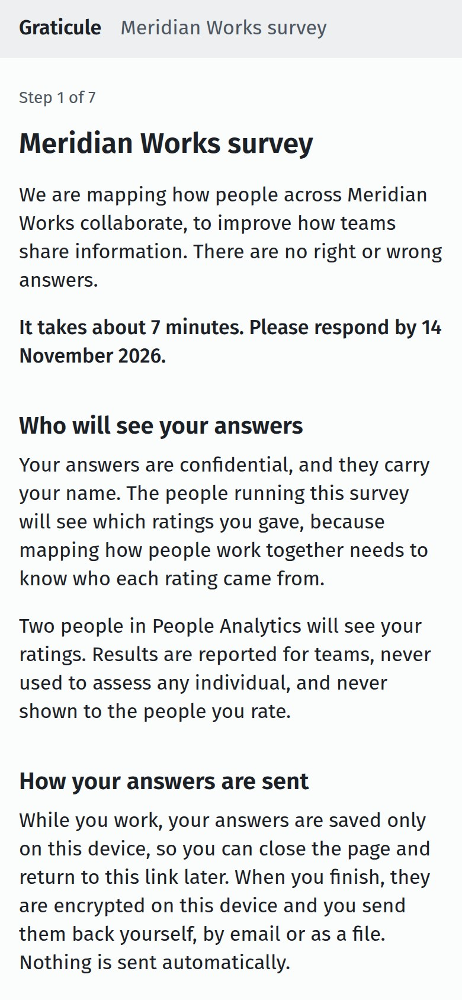

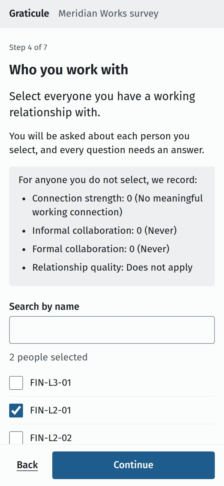

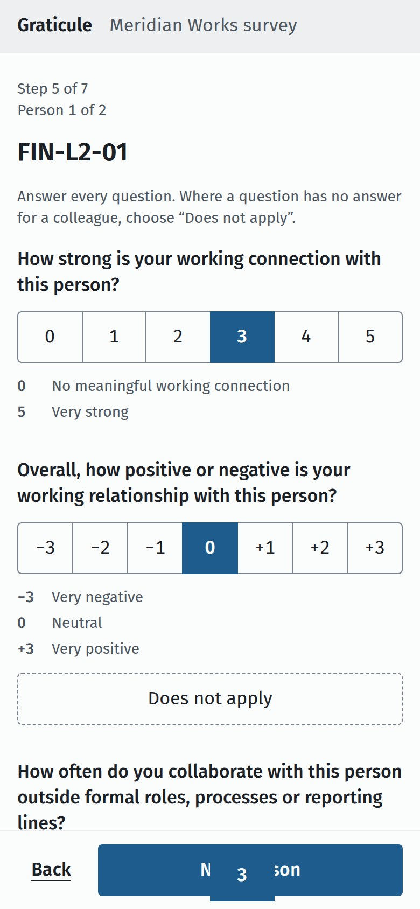

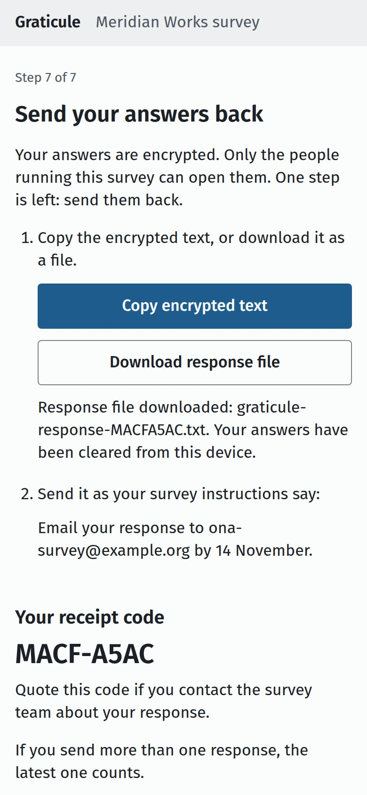

The response is a small text file (named like `graticule-response-7KQ2M4XD.txt`) or a block of text to paste into an email. Each has a receipt code the respondent can quote. [Help for respondents](respondent-help.md) is a one-page explanation you can send with the links.

### Importing responses

On the dashboard, Unlock with the passphrase (it is kept in memory only until you reload or close the page). Drop the response files onto the import area, choose them, or paste response text from emails; several can go at once. Read responses shows a plan before anything changes: responses to import, duplicates, files already imported, rejected files with reasons, and any mapping from an earlier version.

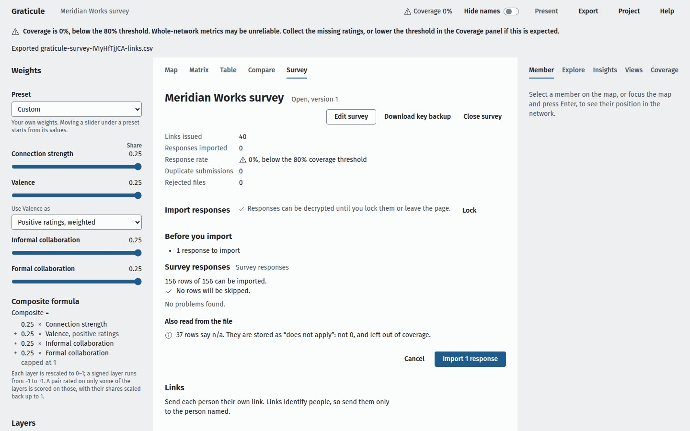

Ratings from responses pass through the same validation report as a ties file, and never overwrite a rating from another source. After importing, delete the response files and the emails that carried them: they are personal data, and their answers are now in your project.

Use Export non-responders for reminders. Close survey stops further imports until you reopen it. If you change who is asked or what they are asked after links have gone out, Graticule creates a new version; earlier links stay valid, and their responses are mapped to the new version by member and layer. The full import rules are in the [method notes](method-notes.md#survey-rules-and-limits).

## Importing and validation

Choose Import survey data (empty workspace or Project menu). Choose a members file and, if you have one, a ties file, then Check files. Importing a members file starts a new project; a ties file on its own is added to the open project, whose members it must name.

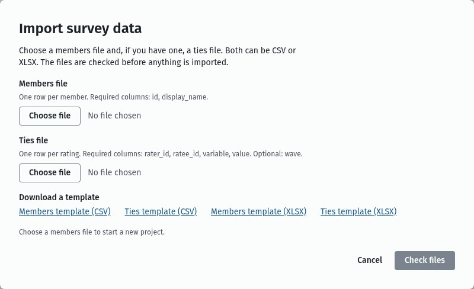

Nothing is imported until the files have been checked. The validation report lists every problem with its row number, as your spreadsheet numbers it (row 1 is the header), and says what to do about it:

- ids that are not in the members file;
- self-ratings;
- values outside the layer's scale;
- duplicate rows (all copies are skipped, so keep one) and ratings the project already has;
- variables that are not layer keys (a close match is suggested);
- values that are not plain numbers, such as "three", "3,5" or "1e2".

Nothing is changed silently. Fix the rows in your file and check it again, or import the valid rows now and skip the rest; the report says how many will be skipped. Notes such as empty values (stored as not rated) and `n/a` values (stored as "does not apply") are listed separately.

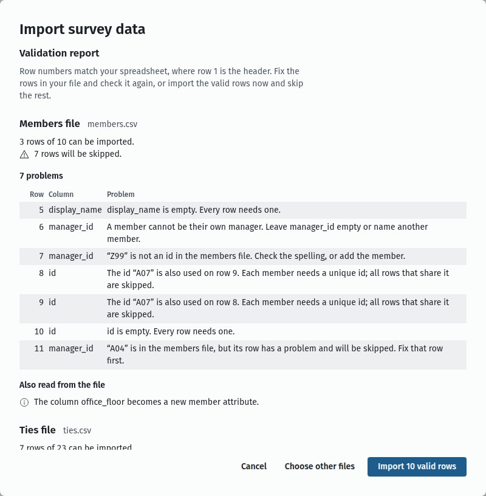

### Entering ratings by hand

The Matrix tab has two modes. Tie strength shows the adjacency matrix. Enter ratings is a grid for one layer, with raters in rows and the people they rate in columns. Move with the arrow keys, type a value and press Enter, press Delete to clear a cell, type `n/a` where the question does not apply, or paste a block copied from a spreadsheet. Self-pairs cannot be edited, and pasted cells that are invalid are skipped and reported.

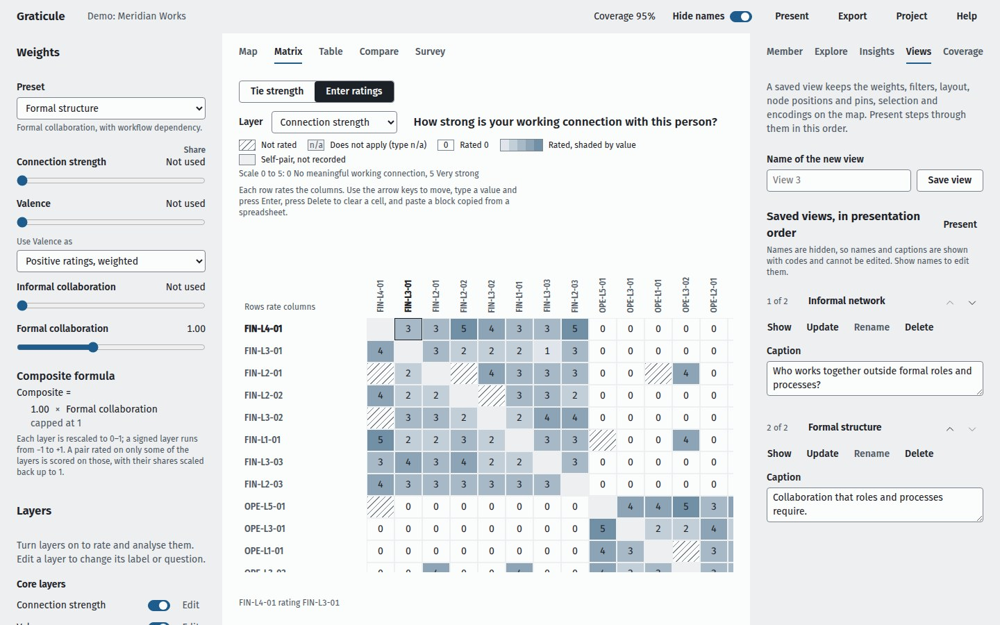

## The map

Once a project has ratings, the Map tab draws the network: each person is a node, and each tie a line.

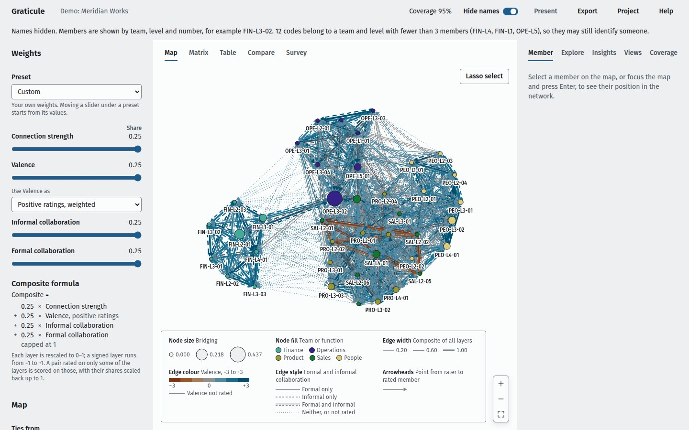

The legend explains every encoding on the map, and is always shown:

- **Node size**: the metric you choose under Node size.
- **Node fill**: an attribute such as team, or detected communities.
- **Edge width**: tie strength on the layer chosen under Ties from.
- **Edge colour**: valence, from orange-brown (negative) through grey (neutral) to blue (positive). Ties with no valence rating are dark grey, so they are never read as neutral.
- **Edge style**: formal only (solid), informal only (dashed), both (solid with a dashed line), or neither (dotted), when both collaboration layers are shown.
- **Arrowheads**: in the directed view, from the rater to the person rated.

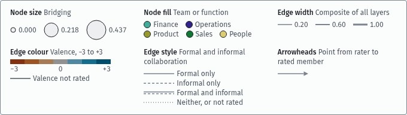

**Map settings** (left column, under Map):

- **Ties from** chooses the layer, or the composite, that sets which ties are drawn, their width, the layout, node size, communities and ranks.
- **Show on the map** switches the encodings of valence and the two collaboration layers on and off. "When a layer is switched off" chooses whether its ties stay or are hidden.
- **Direction.** Directed shows each person's ratings separately. Mutual combines the two directions of each pair, by their average, the weaker or the stronger of the two. The choice changes the metrics, so it is stated in every export.
- **Tie strength at least** hides weaker ties from the drawing only; the metrics still use every tie.
- **Node size**, **Node fill**, **Filter** (by any attribute) and **Search**.
- **Layout**: force-directed (ties pull people together in proportion to their strength), grouped by an attribute, circular by group, or formal hierarchy (managers above their reports, with informal ties drawn over it; it needs a `manager_id` column).

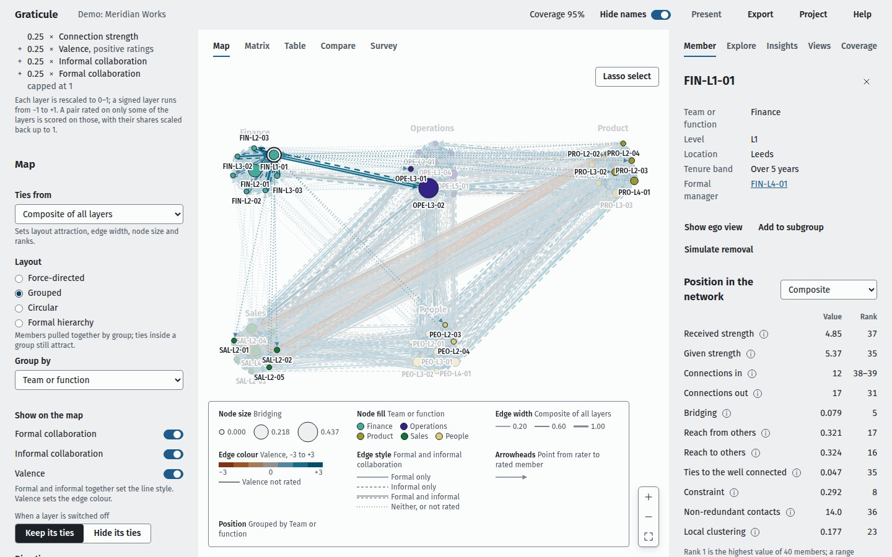

**Interaction.** Hover over a member to highlight their ties; click to open the member panel. Drag a member to pin them, and double-click to release. Scroll or use the buttons to zoom, and Fit to view to see everyone. Shift-click, or Lasso select, adds members to a subgroup.

**Keyboard.** Tab to the map, then use the arrow keys to move to the nearest connected member in that direction. Enter opens the member panel and Escape closes it; Shift and Enter adds a member to the subgroup; plus and minus zoom; 0 fits the map. A table of the members and ties shown is available to screen readers.

### Linked views

Selecting a member, a subgroup, a filter or an ego view applies to every view.

- **Matrix → Tie strength**: an adjacency matrix, shaded by tie strength, which can be ordered by name, attribute, community or a metric.
- **Table**: every member's metrics, sortable by any column. Export table saves it as CSV. Rank stability recalculates a metric many times, each time leaving out some members, and shows the range each rank falls in.
- **Compare**: two layers side by side on the same positions, with their overlap; or formal against informal collaboration, classifying each pair as formal only, informal only, both or neither.

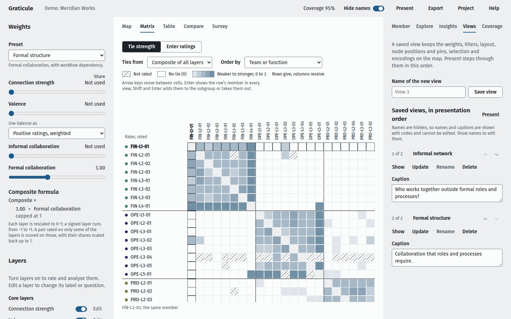

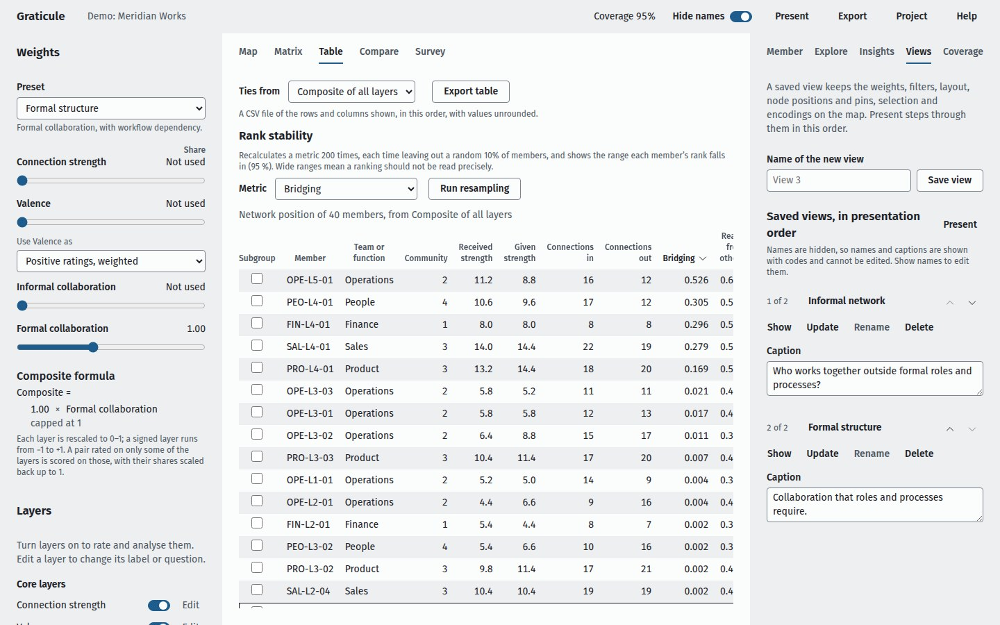

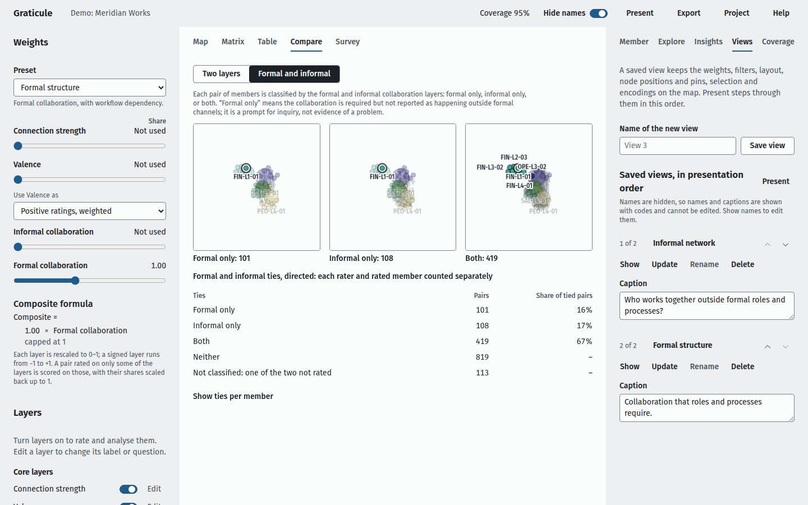

### Explore

The Explore tab (right column) holds four tools, all using the ties from the layer the map draws:

- **Ego view**: one member and everyone within one or two steps of them.
- **Shortest path**: the strongest route between two members, drawn on the map with its distance and steps.
- **Subgroup**: the density of ties inside a group you select, compared with its ties to everyone else, and its E-I index.
- **Resilience**: remove members in a simulation and compare the network before and after (separate parts, pairs that can reach each other, average distance). Nothing in the project changes.

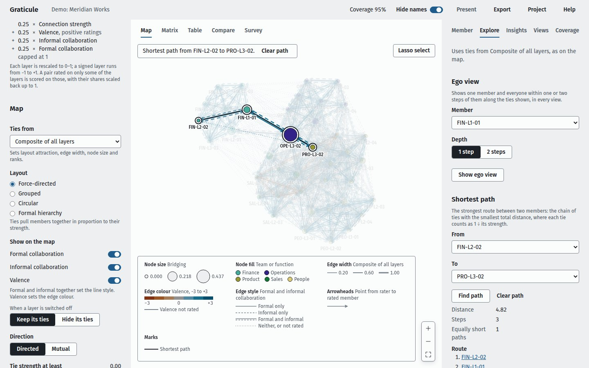

## Reading each metric

Open a member's panel to see their position in the network: each metric's value and rank (1 is the highest), for the layer you choose. The information button beside each metric gives its meaning, caveats and technical name. The formulas are in the [method notes](method-notes.md#3-node-metrics).

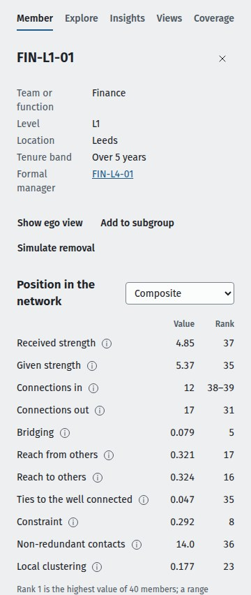

| In the app | What it tells you | Read it with care because |
|---|---|---|
| Received strength / Given strength (Strength when mutual) | How much tie weight a person receives from others, or gives | Given strength reflects how generously someone answered as much as their relationships |
| Connections in / out (Connections when mutual) | How many people a person has a tie with, whatever its strength | A weak tie counts as much as a strong one |
| Bridging | How often a person lies on the shortest routes between others: someone who connects parts of the network that are otherwise far apart | It assumes things travel along shortest paths; one tie can move it a great deal |
| Reach from others / Reach to others (Reach when mutual) | How easily a person is reached by, or reaches, everyone else | Unreachable people add nothing, so it stays defined in a split network |
| Ties to the well connected | Being tied to people who are themselves central | Defined only for the largest group of people who can all reach each other |
| Constraint | How much a person's contacts are tied to each other: high means a closed, redundant circle | People with few contacts score high by construction |
| Non-redundant contacts | The number of contacts who are not tied to each other | At most the number of contacts |
| Local clustering | How many of a person's contacts are tied to one another | Zero for anyone with fewer than two contacts |

A value can be "Not defined", with the reason, for example for someone with no ties on that layer. It is never shown as 0.

**Network measures** (in the network metrics export, the report and the Compare tab): density (the share of possible ties that exist), reciprocity (how often ties are returned), average clustering, components (separate parts), communities found by the Louvain method with their modularity, centralisation (how dominated the network is by one person), the E-I index and cross-group density (whether ties stay within groups or cross between them), structural balance on signed layers, and layer overlap. Each is defined in the [method notes](method-notes.md#4-network-metrics).

**Ranks are not scores.** A rank orders positions in this network, on this layer, from these answers. Positions have many causes (role, tenure, location, workload, who answered the survey), and a small change in ties can change a rank. Run Rank stability in the Table to see how much each rank depends on exactly who took part; a wide range means the ranking should not be read precisely.

### Coverage

The Coverage tab shows the share of possible ratings that were given, per rater and overall, and where the ratings came from (survey responses, imported files or matrix entry). Below the threshold, 80 % by default, a warning stays under the top bar: whole-network metrics may be unreliable, because a missing rating looks like a missing tie. You can change the threshold in the Coverage tab if a lower rate is expected.

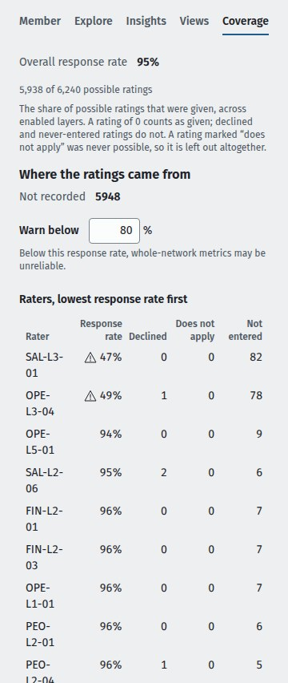

### Insights

The Insights tab lists rule-based observations: potential brokers, peripheral members, possible overload, silos, negative clusters, and formal ties with no informal counterpart (and the reverse). Each is written as a question to explore with the people involved, never as a finding about anyone, and each shows the rule and thresholds that produced it. Show on the map sets the map up to show the observation; Save as view keeps it for a presentation. The rules are in the [method notes](method-notes.md#8-insight-rules).

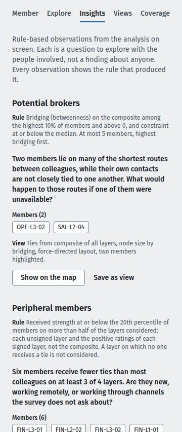

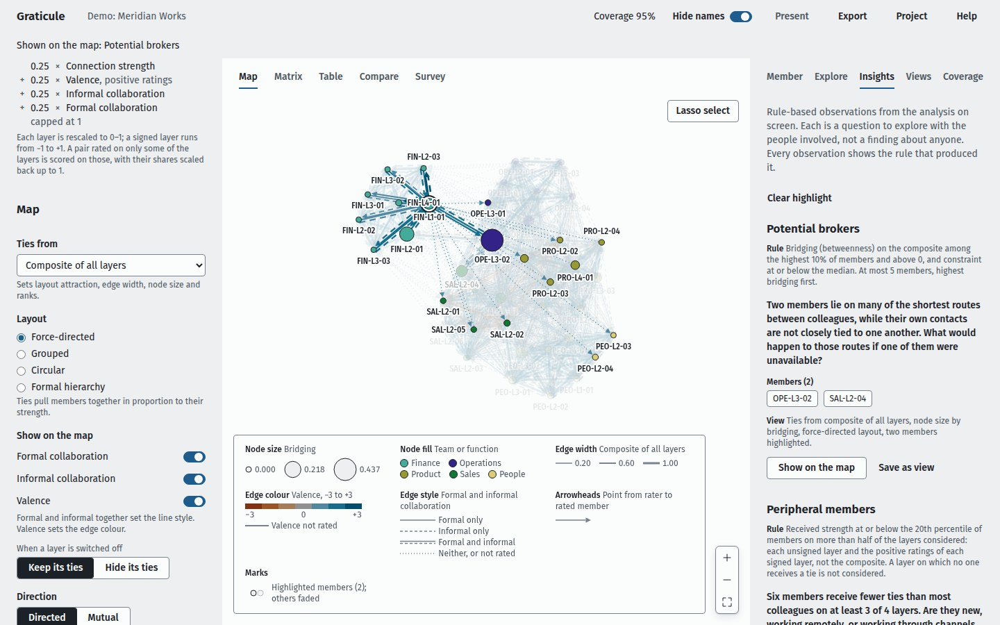

## Composite weighting

Different questions need different relationships. The weight panel at the top of the left column combines the layers into one composite score per pair, which then drives the layout, edge width, node size and all rankings when Ties from is set to the composite.

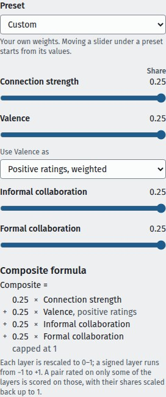

- **Presets.** Formal structure (formal collaboration, with workflow dependency), Informal network (informal collaboration, with advice and idea sharing) and Relationship health (connection strength, positive energy, benevolence-based trust and interpersonal safety, scaled by valence). Layers a preset does not use get weight 0. The preset values are in the [method notes](method-notes.md#presets).
- **Sliders.** One per enabled layer. Each layer is first rescaled to 0–1, and the weights are scaled to add up to 1, so only their proportions matter; each slider shows its share. Moving a slider switches to Custom, starting from the preset's values.
- **Signed layers** (valence, energy) can be used as positive ratings only, as a filter (a negative rating removes the tie), or as a multiplier (a negative rating reduces the composite by up to half, a positive one raises it by up to half).
- **The formula** beneath the sliders shows exactly what is being calculated, in plain notation.

When the weights change, members move smoothly to their new positions so you can see what moved (unless your system asks for reduced motion). The composite is a statement of priorities, not a measurement: say which weights you used whenever you show it. The formula is in the [method notes](method-notes.md#composite).

## Saved views and presentations

A saved view keeps the map as it is: the weights, filters, layout, node positions and pins, selection and encodings. Set up the map, then in the Views tab type a name and Save view. Add a caption to each view: it is shown under the map when presenting, and about 60 characters per line reads well from the back of a room. Use Show to restore a view, Update to replace it with the map as it is now, and the arrows to change the order.

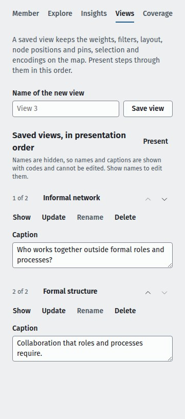

A good presentation is a short sequence of views, each answering one question: for example the informal network, then the formal structure, then one insight shown on the map. Save an insight's view straight from the Insights tab with Save as view; its caption is the insight's question.

Choose Present (top bar or Views tab) to show the views full screen, with the title, the map, the legend and the caption. Use the right arrow, Page down or Space for the next view, the left arrow or Page up for the previous one, Home and End for the first and last, and Escape to leave. Moving the pointer shows a small control bar, which includes Hide names.

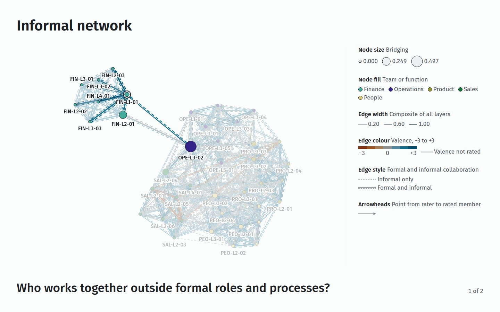

**Hide names** (top bar, presentation controls and Export dialog) replaces every name with a code made from the team, level and a number, for example FIN-L3-02, in every view and export. Codes of small teams can still identify someone; Graticule says how many codes belong to a team and level with fewer than three members.

## Exports

Export (top bar) opens the export dialog. Every export follows its two settings:

- **Hide names**: names are replaced by codes, including names written in captions and titles.
- **Leave out valence, energy and conflict**: these layers hold negative ratings of named colleagues. When left out, the exports are calculated again without them, so no figure depends on them. The setting is saved with the project.

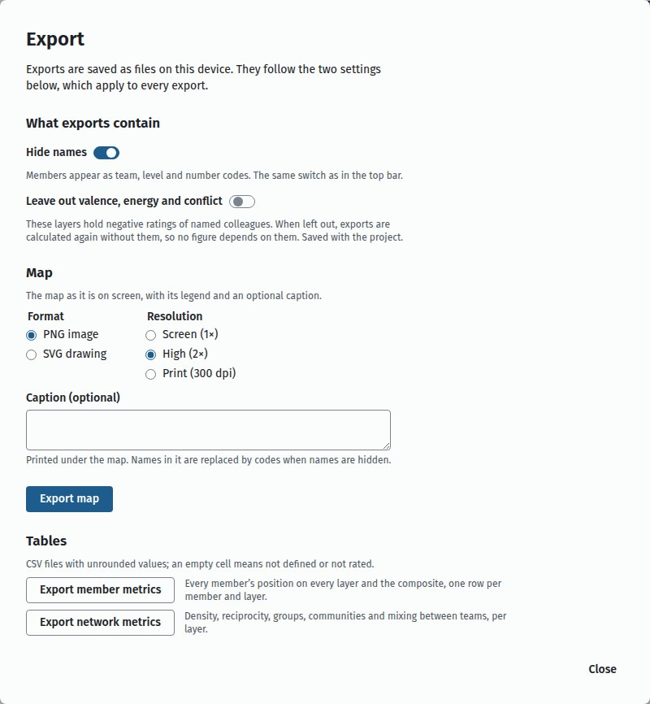

| Export | Contents |
|---|---|
| Map (PNG or SVG) | The map as on screen, with its legend and an optional caption. PNG at screen, double or print resolution (300 dpi across A4 landscape); SVG with its fonts embedded, for print and editing |
| Member metrics (CSV) | Every member's metrics on every layer and the composite, one row per member and layer, unrounded |
| Network metrics (CSV) | Density, reciprocity, components, communities, centralisation, mixing between groups and more, per layer |
| Formal and informal ties (CSV) | Every pair classified as formal only, informal only, both or neither |
| Table (CSV, from the Table tab) | The rows and columns shown, in their order |
| Report (PDF) | The map, key network metrics, insights, method notes, data coverage with survey response rates, and an ethics statement |

In CSV files an empty cell means not defined or not rated. File names end in `-codes` when names are hidden and `-no-signed` when those layers were left out. Exports are ordinary files: store and share them as personal data unless names are hidden and you are sure no code identifies anyone.

## Ethics and consent

Network data about named colleagues is sensitive. Before collecting or loading any:

- **Seek data protection advice.** Processing named employee data is likely to engage data protection law. Agree the lawful basis, retention period, who has access and how results will be reported before you start.
- **Ask for informed consent.** Tell participants what will be collected, why, who will see the results and how they will be used, before they take part. Graticule will not issue a survey without an introduction and a confidentiality statement.
- **Be honest about confidentiality.** Responses are confidential, not anonymous: the analyst sees who gave which ratings, because a whole-network analysis needs it. Never describe the survey as anonymous.
- **Do not use the results to evaluate individuals.** Graticule describes the structure of a network. Its results are not a measure of anyone's performance, and should not be used in performance evaluation or decisions about individuals. Treat each observation as a prompt for conversation with the people involved.
- **Take particular care with negative ratings.** Valence, energy and conflict ratings of named colleagues need a clear purpose. Ask for them only if you need them, restrict who sees them, and use Leave out valence, energy and conflict when exporting for a wider audience.
- **Hide names for wider audiences**, and check the small-group note: a code can still identify someone in a small team.
- **Delete what you no longer need**: response files and the emails that carried them once imported, mail-merge and non-responder lists after the survey, and project files at the end of the agreed retention period. Project → Clear local data removes anything kept in the browser.
- **Mind the limits of the data.** Below the coverage threshold, whole-network metrics may be unreliable. Every metric has caveats, listed in the member panel and the [method notes](method-notes.md).

Your data stays in the browser: Graticule has no server, and its Content Security Policy blocks the page from sending data to other sites. That protection ends when you save a file: exports and project files go wherever you put them.

## Getting help

Help → User guide, Method notes and Help for respondents open these documents inside Graticule; Help → Data and consent notice reopens the first-run notice.

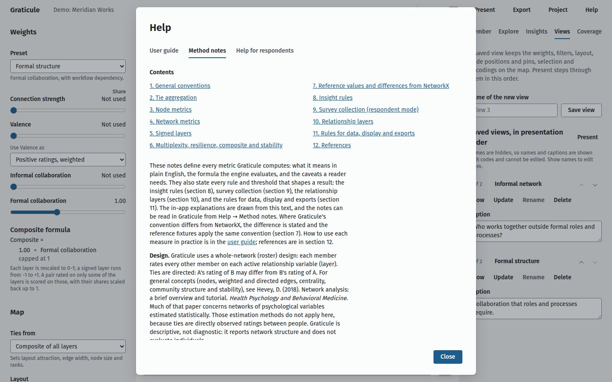
